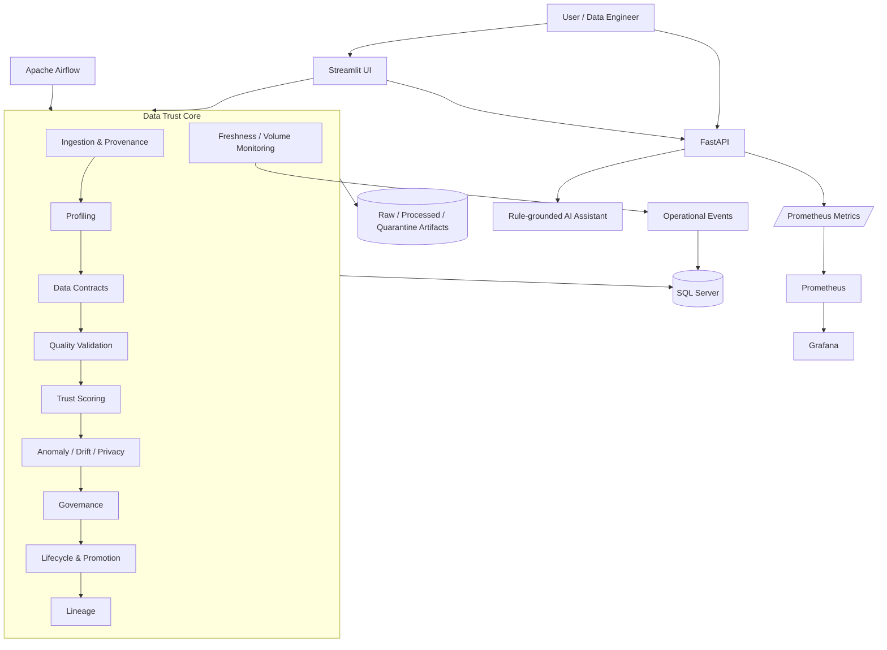
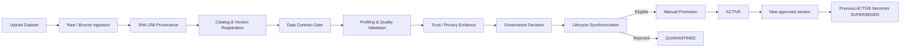

# AI-assisted Data Trust Platform

[](https://github.com/Hungnguyencode/ai-data-trust-platform/actions/workflows/ci.yml)

A portfolio-grade data platform prototype for evaluating whether a dataset is trustworthy enough to be used for analytics, dashboards, or AI/ML workloads.

The platform combines **Data Engineering, Data Quality, Governance, Observability, Orchestration, and an evidence-grounded AI Assistant** in one end-to-end system.

---

## Why this project exists

A dataset arriving in a system does not automatically mean that it is trustworthy.

Before data is promoted for downstream use, a data platform may need to answer questions such as:

- Where did this dataset come from?
- Is this a new version or an already known dataset?
- Does it still satisfy its Data Contract?
- Are important quality rules violated?
- Is sensitive information present?
- Has the data distribution drifted?
- Is the dataset fresh enough?
- Did its row volume suddenly drop or spike?
- Has governance approved the dataset?
- Which version is currently ACTIVE?
- What happened during previous pipeline runs?
- Can the platform explain the evidence behind its decisions?

**AI-assisted Data Trust Platform** models this workflow as a governed and observable data platform rather than a standalone data-analysis script.

---

## Platform capabilities

| Area | Capabilities |
|---|---|
| Ingestion | CSV, Excel and JSON ingestion, Raw/Bronze persistence, SHA-256 provenance |
| Catalog | Dataset catalog, ingestion history and content-based versioning |
| Data Contracts | Versioned contracts, schema/type validation, BLOCK/WARN enforcement |
| Profiling | Schema inference, missing values, duplicates and statistical summaries |
| Data Quality | Rule-based validation, severity classification and quality issues |
| Trust Scoring | Weighted Data Trust Score, risk level and AI-readiness assessment |
| Advanced Checks | Anomaly detection, drift detection and privacy risk scanning |
| Governance | Validation Gate, governance decision and controlled promotion |
| Lifecycle | NEW, VALIDATED, QUARANTINED, ACTIVE and SUPERSEDED states |
| Lineage | End-to-end dataset-version timeline and governance evidence |
| Persistence | SQL Server repositories for scans, datasets, runs and monitoring history |
| API | FastAPI endpoints for platform workflows and operational data |
| UI | Multi-page Streamlit application and observability dashboards |
| Orchestration | Apache Airflow DAGs for pipeline execution and scheduled monitors |
| Observability | Pipeline runs, operational events, Freshness and Volume monitoring |
| Monitoring | Prometheus metrics and Grafana dashboards |
| AI | Rule-grounded assistant that explains supplied platform evidence |
| Engineering | Docker Compose, GitHub Actions, Ruff, pytest and health/readiness probes |

---

## Architecture



The project deliberately keeps core data-trust logic outside the presentation layer so that the same business rules can be reused by Streamlit, FastAPI, Airflow and tests.

---

## Governed dataset workflow



A key design principle is the separation between:

```text
data arrived
```

and:

```text
data is trusted, governed and approved for use
```

Ingestion therefore never makes a dataset ACTIVE automatically.

---

## Data observability

The platform includes operational monitoring on top of the governed dataset workflow.

### Dataset Freshness

Freshness policies define the maximum allowed time since the latest ingestion.

Airflow periodically evaluates enabled policies and persists checks into SQL Server.

Typical statuses:

```text
FRESH
STALE
NO_DATA
```

A STALE condition can emit an operational event without creating duplicate alerts for the same incident.

### Dataset Volume

Volume policies compare the latest ingestion row count with the previous ingestion.

The platform detects:

```text
NORMAL
DROP
SPIKE
NO_BASELINE
```

Volume checks are idempotent and threshold breaches can emit operational events.

### Observability Overview

The platform exposes a consolidated observability view containing:

- monitored datasets,
- Freshness status,
- Volume status,
- latest pipeline status,
- recent operational events,
- historical failed pipeline runs.

This is exposed through FastAPI and rendered by a dedicated Streamlit dashboard.

---

## Airflow orchestration

Apache Airflow is used for orchestration and scheduled monitoring.

Current DAG responsibilities include:

```text
ai_data_trust_pipeline
    Governed data pipeline execution

data_freshness_monitor
    Periodic Freshness policy evaluation

data_volume_monitor
    Periodic dataset row-volume evaluation
```

Freshness and Volume monitors are designed to be safe to execute repeatedly without creating duplicate monitoring records or duplicate alerts for the same event.

---

## AI Assistant

The current assistant is intentionally **rule-grounded and evidence-driven**.

It does not act as an unrestricted chatbot.

The assistant receives structured scan context and can explain information such as:

- Data Trust Score,
- quality issues,
- detected risks,
- priorities,
- recommended actions.

Its current principle is:

> Only answer from provided scan context.

This reduces unsupported conclusions and keeps AI output connected to platform evidence.

A future phase will extend this idea into an **Observability Assistant** capable of reasoning over Trust Score, governance, Freshness, Volume, pipeline failures, operational events and lineage.

```text
Platform Evidence
        ↓
Quality + Trust + Governance
        ↓
Freshness + Volume + Pipeline Events
        ↓
AI Observability Assistant
        ↓
Explain → Diagnose → Recommend
```

---

## FastAPI

The backend exposes health, platform, governance and observability APIs.

Selected endpoints:

| Endpoint | Purpose |
|---|---|
| `GET /health` | Liveness |
| `GET /ready` | Dependency readiness |
| `GET /metrics` | Prometheus metrics |
| `GET /api/info` | Platform information |
| `POST /api/workflows/run` | Governed dataset workflow |
| `GET /api/datasets/{version_id}/lineage` | Dataset lineage |
| `POST /api/datasets/{version_id}/promote` | Governed promotion |
| `POST /api/assistant/ask` | Rule-grounded assistant |
| `GET /api/scans/history` | Persisted scan history |
| `GET /api/pipeline-runs` | Pipeline run history |
| `GET /api/operational-events` | Operational event history |
| `GET /api/freshness/catalog/{catalog_id}/history` | Freshness history |
| `POST /api/freshness/catalog/{catalog_id}/check` | Run Freshness check |
| `GET /api/volume/catalog/{catalog_id}/history` | Volume history |
| `POST /api/volume/catalog/{catalog_id}/check` | Run Volume check |
| `GET /api/observability/overview` | Consolidated observability state |

Interactive OpenAPI documentation is available at:

```text
http://localhost:8000/docs
```

---

## Streamlit dashboards

The Streamlit application provides interfaces for the major platform capabilities, including:

- dataset upload and governed workflow execution,
- data profiling,
- quality issues,
- Data Trust Score,
- anomaly detection,
- drift detection,
- privacy risk,
- AI Assistant,
- dataset governance and lifecycle,
- Freshness monitoring,
- Volume monitoring,
- Data Observability Overview.

The newer observability pages use dedicated API client modules instead of embedding HTTP request logic directly inside UI code.

---

## Persistence and lineage

SQL Server stores operational and governance history including:

```text
datasets
dataset versions
ingestion events
validation results
governance decisions
lifecycle events
scan history
quality issues
pipeline runs
operational events
Freshness policies and checks
Volume policies and checks
Data Contracts
```

Dataset lineage links these records into a version-specific history so that the platform can explain how a dataset reached its current state.

---

## Monitoring

FastAPI exports Prometheus metrics through:

```text
/metrics
```

The monitoring stack contains:

```text
FastAPI
   ↓
Prometheus
   ↓
Grafana
```

Request metrics use route templates rather than raw resource IDs to avoid unnecessary Prometheus label cardinality.

Health and readiness probes are excluded from business request metrics so infrastructure polling does not distort application traffic.

---

## Technology stack

| Layer | Technologies |
|---|---|
| Language | Python 3.12 |
| Data | pandas, NumPy |
| Statistical / ML checks | SciPy / scikit-learn based detection |
| Backend | FastAPI, Pydantic |
| UI | Streamlit, Plotly |
| Database | Microsoft SQL Server, SQLAlchemy |
| Orchestration | Apache Airflow 3 |
| Monitoring | Prometheus, Grafana |
| Containers | Docker, Docker Compose |
| Testing | pytest |
| Linting | Ruff |
| CI | GitHub Actions |

---

## Repository structure

```text
ai-data-trust-platform/
├── api/                     # FastAPI routes and schemas
├── app/
│   ├── pages/               # Streamlit pages
│   └── services/            # Streamlit API clients
├── database/
│   ├── migrations/          # SQL Server migrations
│   └── repositories/        # Persistence layer
├── orchestration/
│   └── airflow/
│       └── dags/            # Airflow DAGs
├── monitoring/              # Prometheus / Grafana configuration
├── src/
│   ├── anomaly/
│   ├── assistant/
│   ├── data_contracts/
│   ├── drift/
│   ├── governance/
│   ├── ingestion/
│   ├── lifecycle/
│   ├── lineage/
│   ├── observability/
│   ├── privacy/
│   ├── profiling/
│   ├── scoring/
│   ├── validation/
│   └── workflows/
├── tests/
├── docs/
├── compose.yaml
├── Dockerfile
├── Dockerfile.airflow
└── README.md
```

---

## Quick start

### 1. Clone the repository

```bash
git clone https://github.com/Hungnguyencode/ai-data-trust-platform.git
cd ai-data-trust-platform
```

### 2. Create environment configuration

Copy:

```text
.env.example
```

to:

```text
.env
```

and configure the required local values.

Do not commit `.env`.

### 3. Start the core platform

```bash
docker compose up -d --build
```

### 4. Start Airflow

```bash
docker compose --profile orchestration up -d --build airflow
```

### 5. Check containers

```bash
docker compose ps
```

---

## Local services

| Service | URL |
|---|---|
| Streamlit | `http://localhost:8501` |
| FastAPI | `http://localhost:8000` |
| Swagger / OpenAPI | `http://localhost:8000/docs` |
| Airflow | `http://localhost:8080` |
| Prometheus | `http://localhost:9090` |
| Grafana | `http://localhost:3000` |

---

## Development validation

Run linting:

```bash
ruff check .
```

Run the test suite:

```bash
python -m pytest -q
```

Compile project modules:

```bash
python -m compileall api src database app orchestration
```

Check whitespace problems before committing:

```bash
git diff --check
```

The project currently contains an extensive automated test suite covering core logic, repositories, APIs, monitoring behavior, Airflow integration and Streamlit API clients.

---

## Engineering decisions worth discussing

### Core logic is not owned by the UI

Business rules live in reusable modules and repositories instead of being implemented independently in each interface.

### Ingestion is not approval

A successfully ingested dataset does not automatically become ACTIVE.

Validation, governance and promotion remain separate decisions.

### Versioning uses provenance

SHA-256 based provenance allows the platform to distinguish new content from repeated ingestion events.

### Monitoring is idempotent

Repeated Airflow executions should not create duplicate Volume checks or duplicate alerts for the same incident.

### Observability uses persisted evidence

Freshness, Volume, pipeline runs and operational events are stored rather than existing only as transient dashboard state.

### Metrics are designed for bounded cardinality

FastAPI metrics use route templates instead of raw IDs.

### AI is grounded in platform evidence

The assistant is deliberately constrained to supplied context instead of presenting unsupported generated conclusions as facts.

---

## Project scope

This repository is a **portfolio and learning-oriented platform prototype**, not a production SaaS product.

It intentionally focuses on architecture, data-platform behavior, traceability and engineering practices rather than enterprise-scale infrastructure.

---

## Next development phase

The next major technical phase is an **AI Observability Assistant**.

The goal is to let the assistant combine platform evidence such as:

```text
Data Quality
Trust Score
Governance
Lineage
Freshness
Volume
Pipeline Runs
Operational Events
```

and answer questions such as:

```text
Why is this dataset currently unhealthy?

Why should this version not be promoted?

What changed since the previous ingestion?

Which problem should be investigated first?

What evidence supports this recommendation?
```

The assistant will remain evidence-grounded: explanations and recommendations must be traceable to actual platform state.

---

## Portfolio summary

**AI-assisted Data Trust Platform** demonstrates how data engineering, quality controls, governance, observability and AI-assisted explanation can be combined into one traceable dataset lifecycle.

It is designed to show practical understanding of:

```text
Data Engineering
Data Quality
Data Governance
Data Observability
Backend APIs
Workflow Orchestration
SQL Persistence
Testing
Containerization
Monitoring
Evidence-grounded AI
```