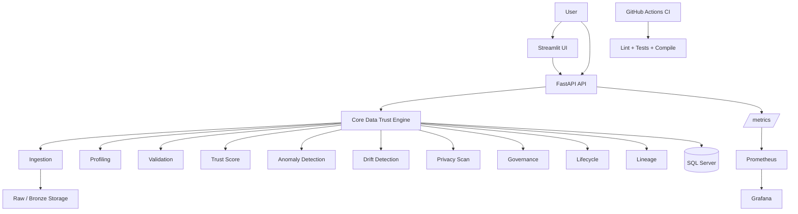

# AI Data Trust Platform

> Nền tảng đánh giá độ tin cậy dữ liệu theo hướng **Data Engineering + Data Quality + Governance + Observability**, có giao diện Streamlit, FastAPI backend, SQL Server persistence, pipeline kiểm tra dữ liệu, AI Assistant dạng rule-grounded và monitoring bằng Prometheus/Grafana.

---

## 1. Tổng quan

**AI Data Trust Platform** là một project học tập/portfolio được xây dựng để mô phỏng một nền tảng kiểm soát độ tin cậy của dữ liệu trước khi dữ liệu được dùng cho phân tích, dashboard hoặc AI/ML.

Thay vì chỉ đọc một file CSV rồi chấm điểm, project phát triển dần thành một hệ thống có nhiều lớp:

- Ingest dữ liệu và lưu Raw/Bronze artifact.
- Tạo metadata và SHA-256 để truy vết nguồn dữ liệu.
- Data Profiling.
- Data Quality Validation.
- Data Trust Score.
- Anomaly Detection.
- Data Drift Detection.
- Privacy Risk Scan.
- Dataset Catalog và Versioning.
- Validation Gate.
- Governance Decision.
- Dataset Lifecycle.
- Manual Promotion sang trạng thái ACTIVE.
- End-to-end Dataset Lineage.
- Persist scan history vào SQL Server.
- FastAPI backend.
- Streamlit UI.
- Rule-grounded AI Assistant.
- Structured request logging.
- Prometheus metrics.
- Grafana observability dashboard.
- Docker Compose.
- GitHub Actions CI.
- Automated tests và linting.

Ở checkpoint hiện tại, project đã vượt khỏi mức “data analysis demo” và bắt đầu mang hình dáng của một **data platform prototype có governance và observability**.

---

## 2. Mục tiêu của project

Project được xây dựng với ba mục tiêu chính.

### 2.1. Data Engineering

Mô phỏng một quy trình dữ liệu có:

- ingestion,
- raw storage,
- metadata,
- catalog,
- versioning,
- validation,
- persistence,
- lifecycle,
- lineage,
- API,
- containerization,
- monitoring.

### 2.2. Data Quality & Governance

Đánh giá dataset trước khi sử dụng thông qua:

- profiling,
- quality rules,
- trust score,
- privacy checks,
- drift checks,
- governance decision,
- controlled promotion.

### 2.3. AI-assisted Data Platform

AI Assistant không tự “bịa” kiến thức ngoài dữ liệu đang có.

Assistant hoạt động theo hướng **rule-grounded**:

- lấy context từ kết quả scan,
- giải thích Trust Score,
- giải thích quality issue,
- nêu priority action,
- không suy diễn ngoài context đã được cung cấp.

---

## 3. Trạng thái hiện tại

Tại checkpoint hiện tại:

| Hạng mục | Trạng thái |
|---|---|
| Data Profiling | ✅ |
| Data Quality Validation | ✅ |
| Data Trust Score | ✅ |
| Anomaly Detection | ✅ |
| Data Drift | ✅ |
| Privacy Risk Scan | ✅ |
| HTML Report | ✅ |
| Rule-grounded AI Assistant | ✅ |
| Raw/Bronze ingestion | ✅ |
| Dataset Catalog | ✅ |
| Dataset Versioning | ✅ |
| Validation Gate | ✅ |
| Governance Decision | ✅ |
| Dataset Lifecycle | ✅ |
| Dataset Promotion | ✅ |
| Dataset Lineage | ✅ |
| SQL Server persistence | ✅ |
| Scan History API | ✅ |
| FastAPI backend | ✅ |
| Streamlit UI | ✅ |
| Docker Compose | ✅ |
| Health / Readiness probes | ✅ |
| Structured request logging | ✅ |
| Prometheus metrics | ✅ |
| Prometheus server | ✅ |
| Grafana dashboard | ✅ |
| GitHub Actions CI | ✅ |
| Ruff linting | ✅ |
| Automated tests | ✅ |
| Secret/config hardening | ✅ |

Checkpoint gần nhất đã chạy:

```text
ruff check .
All checks passed!

python -m pytest -q
131 passed
```

---

## 4. Kiến trúc tổng thể



Có thể hiểu đơn giản:

```text
                ┌────────────────────┐
                │    Streamlit UI    │
                └─────────┬──────────┘
                          │
                          ▼
                ┌────────────────────┐
                │      FastAPI       │
                └──────┬───────┬─────┘
                       │       │
                       │       └──────────────► /metrics
                       │                            │
                       ▼                            ▼
            ┌──────────────────┐             Prometheus
            │ Data Trust Core  │                  │
            └────────┬─────────┘                  ▼
                     │                          Grafana
          ┌──────────┼───────────┐
          ▼          ▼           ▼
     Raw/Bronze   SQL Server   Reports
```

---

## 5. Luồng xử lý dataset end-to-end

Luồng chính của project hiện tại:

```text
Upload Dataset
      ↓
Raw/Bronze Ingestion
      ↓
SHA-256 + Ingestion Metadata
      ↓
Dataset Profiling
      ↓
Catalog / Version Registration
      ↓
Validation Gate
      ↓
Governance Decision
      ↓
Lifecycle Synchronization
      ↓
Manual Promotion nếu đủ điều kiện
      ↓
ACTIVE
      ↓
Version mới được promote
      ↓
Version ACTIVE cũ → SUPERSEDED
```

### Ý nghĩa

Project không tự động promote dữ liệu thành `ACTIVE` ngay sau upload.

Dataset phải đi qua các lớp kiểm soát trước.

Đây là một quyết định thiết kế quan trọng vì nó tách:

```text
data arrived
```

khỏi:

```text
data is trusted and approved for use
```

---

# 6. Ingestion và Raw/Bronze Layer

Khi người dùng upload dataset, hệ thống:

1. đọc file,
2. chuẩn hóa tên file,
3. tính SHA-256,
4. tạo `ingestion_id`,
5. lưu raw artifact,
6. lưu metadata phục vụ truy vết.

Các định dạng đang hỗ trợ gồm:

- CSV,
- Excel,
- JSON.

Metadata ingestion chứa các thông tin như:

- ingestion ID,
- file name,
- file type,
- SHA-256,
- byte size,
- source type,
- raw path.

Raw data được xem là artifact gốc để phục vụ provenance và reproducibility.

---

## 7. Dataset Catalog và Versioning

Sau ingestion, dataset được đăng ký vào SQL Server Dataset Catalog.

Versioning sử dụng nội dung file để phân biệt phiên bản.

Ví dụ:

```text
cùng logical dataset
+
SHA-256 khác
=
dataset version mới
```

Nếu cùng SHA-256 đã tồn tại, hệ thống có thể tái sử dụng version cũ và chỉ ghi thêm ingestion event.

Điều này giúp project mô phỏng cách một data platform quản lý lịch sử dữ liệu thay vì overwrite dữ liệu một cách mù quáng.

---

# 8. Data Profiling

Module profiling tự động phân tích:

- số dòng,
- số cột,
- tổng số cell,
- missing cells,
- duplicate rows,
- schema,
- kiểu dữ liệu,
- numeric summary,
- categorical summary.

Hệ thống nhận diện các nhóm cột:

- Numeric,
- Categorical,
- Datetime,
- Boolean,
- Text.

Streamlit hiển thị:

- dataset overview,
- schema summary,
- missing summary,
- numeric distribution,
- categorical distribution,
- data preview.

---

# 9. Data Quality Validation

Quality engine kiểm tra các nhóm vấn đề dữ liệu như:

- missing value,
- duplicate rows,
- type issue,
- range issue,
- categorical validity,
- consistency.

Issue được phân loại theo severity:

```text
High
Medium
Low
```

Quality report gồm:

- tổng số issue,
- số issue theo severity,
- số cột bị ảnh hưởng,
- mô tả,
- recommendation.

---

## 10. Validation Gate

Project có Validation Gate thay vì chỉ “scan rồi hiển thị lỗi”.

Policy hiện tại theo hướng:

```text
High severity issue
        ↓
      BLOCK
        ↓
    REJECTED
        ↓
 data/quarantine
```

Trong khi:

```text
Không có blocking issue
        ↓
     ACCEPTED
        ↓
validated artifact / Silver candidate
```

Validation artifact và metadata được lưu để phục vụ audit.

Validation result cũng được persist vào SQL Server.

---

# 11. Data Trust Score

Trust Score cung cấp một điểm tổng hợp cho dataset.

Các thành phần đánh giá xoay quanh:

- Completeness,
- Consistency,
- Validity,
- Quality,
- Outlier / Anomaly signals.

Output chính gồm:

- Overall Data Trust Score,
- Risk Level,
- AI Readiness,
- Score Breakdown,
- Weighted Contribution,
- Recommendation.

Ví dụ:

```text
Overall Score: 92.14 / 100
Risk Level: Low
AI Readiness: Ready for Analytics and ML
```

FastAPI và Streamlit dùng cùng core scoring engine để tránh việc mỗi layer tự duy trì một công thức riêng.

Đây là nguyên tắc:

> **Single source of truth cho business logic.**

---

# 12. Anomaly Detection

Project sử dụng nhiều phương pháp phát hiện bất thường:

### IQR

Phát hiện outlier dựa trên khoảng tứ phân vị.

### Z-score

Phát hiện giá trị lệch xa trung bình theo độ lệch chuẩn.

### Isolation Forest

Sử dụng Scikit-learn để phát hiện row bất thường theo nhiều biến.

Hệ thống tổng hợp:

- anomaly rows,
- anomaly rate,
- anomaly score,
- risk level,
- kết quả theo từng detector.

---

# 13. Data Drift

Drift module so sánh:

```text
Baseline Dataset
vs
Current Dataset
```

Các kiểm tra hiện tại gồm:

### Schema Drift

- added columns,
- removed columns,
- dtype changes.

### Numeric Drift

- PSI,
- KS-test,
- so sánh distribution.

### Categorical Drift

- distribution difference,
- Chi-square-based checks,
- category distribution visualization.

Kết quả gồm:

- Drift Score,
- Overall Drift Level,
- Drifted Columns,
- High Drift Columns,
- Moderate Drift Columns,
- Schema Drift Count.

---

# 14. Privacy Risk Scanner

Privacy module dùng rule-based detection để tìm các trường nhạy cảm.

Các nhóm đang được kiểm tra gồm:

- email,
- phone,
- citizen ID / CCCD / CMND,
- name,
- address,
- column-name heuristic.

Output:

- Privacy Safety Score,
- Risk Level,
- số cột có PII,
- số cell có dấu hiệu PII,
- PII cell rate,
- danh sách finding,
- recommendation.

Mục tiêu của module này không phải thay thế một DLP enterprise, mà mô phỏng privacy check trong data quality/governance workflow.

---

# 15. Governance Decision

Sau Validation Gate, hệ thống tạo Governance Decision.

Các trạng thái có thể gồm:

```text
APPROVED
REVIEW_REQUIRED
REJECTED
```

Governance Decision dựa trên evidence đã có, ví dụ:

- validation status,
- trust score,
- privacy status,
- policy.

Kết quả governance được persist vào SQL Server và trở thành một phần của lineage.

---

# 16. Dataset Lifecycle

Project quản lý lifecycle cho dataset version.

Các state chính:

```text
NEW
VALIDATED
QUARANTINED
ACTIVE
SUPERSEDED
```

Luồng điển hình:

```text
NEW
 ↓
VALIDATED
 ↓
ACTIVE
```

Nếu validation fail:

```text
NEW
 ↓
QUARANTINED
```

Khi version mới được promote thành ACTIVE:

```text
ACTIVE version cũ
        ↓
   SUPERSEDED
```

Promotion không được thực hiện nếu governance chưa approve.

---

# 17. Governance-aware Promotion

Promotion là action riêng, không tự động chạy trong workflow ingestion.

Điều kiện promotion được kiểm tra trong core/repository layer.

FastAPI chỉ đóng vai trò transport.

Ví dụ endpoint:

```text
POST /api/datasets/{version_id}/promote
```

Thiết kế này giúp business rule không bị rải rác giữa UI và API.

---

# 18. Dataset Lineage

Project hỗ trợ lineage theo từng dataset version.

Lineage kết nối các event:

```text
Raw/Bronze
    ↓
Ingestion
    ↓
Validation
    ↓
Governance
    ↓
Lifecycle
    ↓
ACTIVE / SUPERSEDED
```

Thông tin lineage có thể bao gồm:

- version,
- ingestion history,
- validation history,
- governance history,
- lifecycle events,
- timeline,
- current lifecycle state,
- latest governance evidence,
- trust score,
- privacy status,
- raw artifact path,
- validation artifact.

FastAPI endpoint:

```text
GET /api/datasets/{version_id}/lineage
```

---

# 19. Persisted Scan History

Kết quả scan có thể được lưu vào SQL Server.

Một full scan có thể gồm:

- dataset metadata,
- scan run,
- Trust Score,
- quality issues.

API hỗ trợ truy vấn:

```text
GET /api/scans/history
GET /api/scans/latest
GET /api/scans/{scan_id}
```

Điều này giúp project chuyển từ:

```text
kết quả chỉ sống trong session
```

sang:

```text
kết quả có persistence và history
```

---

# 20. AI Assistant

AI Assistant hiện là **rule-grounded assistant**.

Nguyên tắc:

> Chỉ giải thích dựa trên scan context đã có.

Assistant có thể hỗ trợ:

- giải thích Trust Score,
- giải thích quality issues,
- đánh giá risk,
- nêu priority actions,
- tóm tắt dataset,
- giải thích anomaly/privacy/drift khi context tồn tại.

Assistant không được thiết kế để tự tạo fact ngoài scan result.

API:

```text
POST /api/assistant/ask
GET  /api/assistant/status
```

---

# 21. FastAPI Backend

FastAPI hiện là backend transport layer cho các capability chính.

API version hiện tại:

```text
2.6.0
```

## Main endpoints

| Method | Endpoint | Chức năng |
|---|---|---|
| GET | `/` | API root |
| GET | `/health` | Liveness |
| GET | `/ready` | Readiness + SQL Server dependency |
| GET | `/metrics` | Prometheus metrics |
| GET | `/api/info` | Thông tin API |
| POST | `/api/datasets/overview` | Dataset overview |
| POST | `/api/datasets/preview` | Dataset preview |
| GET | `/api/datasets/{version_id}/lineage` | Version lineage |
| POST | `/api/datasets/{version_id}/promote` | Promotion |
| GET | `/api/scans/history` | Scan history |
| GET | `/api/scans/latest` | Latest scan |
| GET | `/api/scans/{scan_id}` | Scan detail |
| POST | `/api/scores/calculate` | Trust Score |
| POST | `/api/workflows/run` | Governed dataset workflow |
| POST | `/api/assistant/ask` | Assistant |
| GET | `/api/assistant/status` | Assistant status |

Swagger:

```text
http://localhost:8000/docs
```

---

# 22. Health và Readiness

Project tách hai khái niệm:

### Liveness

```text
GET /health
```

Trả lời câu hỏi:

> API process có đang sống không?

### Readiness

```text
GET /ready
```

Trả lời câu hỏi:

> API có sẵn sàng phục vụ và dependency SQL Server có hoạt động không?

Ví dụ:

```json
{
  "status": "ready",
  "service": "ai-data-trust-api",
  "version": "2.6.0",
  "dependencies": {
    "sqlserver": "ok"
  }
}
```

---

# 23. Request Logging và Request ID

HTTP middleware:

- sinh `X-Request-ID`,
- đo duration,
- log method,
- path,
- status code,
- duration,
- log exception với status 500.

Ví dụ structured event:

```json
{
  "event": "http_request",
  "request_id": "...",
  "method": "GET",
  "path": "/api/scans/history",
  "status_code": 200,
  "duration_ms": 120.5
}
```

---

# 24. Prometheus Metrics

FastAPI expose metrics tại:

```text
http://localhost:8000/metrics
```

Custom metrics chính:

```text
ai_data_trust_http_requests_total
ai_data_trust_http_request_duration_seconds
```

Ví dụ:

```text
ai_data_trust_http_requests_total{
  method="GET",
  path="/api/scans/history",
  status_code="200"
}
```

---

## 24.1. Low-cardinality route labels

Dynamic URL không được lưu trực tiếp kiểu:

```text
/api/scans/1
/api/scans/2
/api/scans/93844
```

Thay vào đó được normalize:

```text
/api/scans/{scan_id}
```

Điều này giúp tránh **high-cardinality metrics**, một vấn đề quan trọng khi dùng Prometheus.

---

## 24.2. Probe exclusion

Các endpoint sau được loại khỏi business request metrics:

```text
/health
/ready
/metrics
```

Mục đích là tránh việc health probe và Prometheus scrape làm méo traffic thực của ứng dụng.

---

# 25. Prometheus Server

Prometheus chạy bằng Docker.

Version hiện đang được pin:

```text
prom/prometheus:v3.14.0
```

Prometheus scrape:

```text
http://api:8000/metrics
```

theo Docker network.

Scrape interval hiện tại:

```text
15s
```

Prometheus UI:

```text
http://localhost:9090
```

Target status:

```text
http://localhost:9090/targets
```

Khi target khỏe:

```text
ai-data-trust-api
UP
```

PromQL ví dụ:

```promql
up{job="ai-data-trust-api"}
```

```promql
ai_data_trust_http_requests_total
```

```promql
sum by (path) (
  rate(ai_data_trust_http_requests_total[5m])
)
```

---

# 26. Grafana Dashboard

Grafana hiện được pin version:

```text
grafana/grafana:13.2.1
```

URL:

```text
http://localhost:3000
```

Datasource Prometheus được **provision tự động** từ source code.

Dashboard cũng được provision từ repository, không cần tạo thủ công sau mỗi lần clone project.

Dashboard:

```text
AI Data Trust Platform - API Observability
```

Các panel hiện tại:

- API Status
- Request Rate
- HTTP 5xx Error Rate
- P95 Latency
- Traffic by Endpoint

Dashboard refresh:

```text
10s
```

Vì Prometheus scrape mỗi 15 giây và Grafana refresh mỗi 10 giây, dashboard mang tính:

> **near real-time monitoring**

chứ không phải WebSocket streaming theo từng millisecond.

---

# 27. Observability Flow

```text
HTTP Request
     ↓
FastAPI Middleware
     ↓
Custom Metrics
     ↓
/metrics
     ↓
Prometheus Scrape
     ↓
Prometheus TSDB
     ↓
PromQL
     ↓
Grafana Dashboard
```

Một cách nhớ ngắn:

```text
App tạo metrics
Prometheus thu metrics
Grafana vẽ metrics
```

---

# 28. Docker Compose

Hệ thống hiện chạy nhiều service:

| Service | Vai trò |
|---|---|
| `sqlserver` | Persistent database |
| `bootstrap` | Khởi tạo/migrate database |
| `api` | FastAPI backend |
| `ui` | Streamlit frontend |
| `prometheus` | Metrics collection |
| `grafana` | Monitoring dashboard |

Các named volume gồm:

- `sqlserver_data`
- `platform_data`
- `prometheus_data`
- `grafana_data`

---

## 28.1. Startup dependency

Luồng khởi động Docker được kiểm soát:

```text
SQL Server
    ↓ healthy
Bootstrap
    ↓ exited 0
API
    ↓ healthy
UI / Prometheus
    ↓
Grafana
```

`bootstrap` kết thúc với:

```text
Exited (0)
```

là trạng thái bình thường vì đây là one-shot initialization service.

---

# 29. Docker Health Checks

Các service quan trọng có health check.

API:

```text
GET /health
```

Streamlit:

```text
/_stcore/health
```

SQL Server:

```text
SELECT 1
```

Compose sử dụng dependency condition để giảm lỗi race condition khi startup.

---

# 30. Secret và Environment Configuration

Secret thật được lưu trong:

```text
.env
```

File này bị `.gitignore`.

Repository chỉ track:

```text
.env.example
```

Các secret chính:

```dotenv
DB_PASSWORD=
MSSQL_SA_PASSWORD=
```

Compose sử dụng fail-fast environment expansion để tránh trường hợp password bị resolve thành chuỗi rỗng.

Ví dụ:

```yaml
DB_PASSWORD: ${DB_PASSWORD:?DB_PASSWORD is required}
```

và:

```yaml
MSSQL_SA_PASSWORD: "${MSSQL_SA_PASSWORD:?MSSQL_SA_PASSWORD is required}"
```

> Không commit password thật vào `.env.example`.

Lưu ý: `docker compose config` có thể in ra giá trị environment đã resolve, vì vậy không nên đăng nguyên output đó lên README, Issue hoặc screenshot công khai nếu có secret.

---

# 31. CI với GitHub Actions

Project có CI workflow chạy trên:

```text
push:
- main
- feature/**

pull_request:
- main
```

Pipeline hiện kiểm tra:

1. checkout repository,
2. setup Python 3.12,
3. cài system dependencies,
4. cài `requirements-dev.txt`,
5. `pip check`,
6. Ruff,
7. Pytest,
8. Compile Python modules.

Các command chính:

```bash
python -m ruff check .
python -m pytest -q
python -m compileall api src database app
```

CI đã được dùng xuyên suốt các commit observability và secret hardening.

---

# 32. Testing

Project có test cho nhiều layer:

- profiling,
- validation,
- scoring,
- anomaly,
- lifecycle,
- lineage,
- repositories,
- API,
- observability,
- scan history,
- validation gate.

Checkpoint hiện tại:

```text
131 passed
```

Một số observability test đảm bảo:

- metric counter hoạt động,
- histogram hoạt động,
- dynamic path được normalize,
- probe endpoint không bị tính vào request metrics.

---

# 33. Công nghệ sử dụng

## Core

- Python 3.12
- Pandas
- NumPy

## Machine Learning / Statistical Detection

- Scikit-learn
- SciPy/statistical checks
- Isolation Forest
- IQR
- Z-score

## Backend

- FastAPI
- Pydantic
- Uvicorn

## Frontend

- Streamlit

## Visualization

- Plotly
- Grafana

## Database

- Microsoft SQL Server 2022
- pyodbc / ODBC Driver

## Observability

- Prometheus client
- Prometheus
- Grafana

## DevOps

- Docker
- Docker Compose
- GitHub Actions

## Quality

- Pytest
- Ruff

---

# 34. Cấu trúc thư mục chính

```text
ai-data-trust-platform/
├── .github/
│   └── workflows/
│       └── ci.yml
│
├── api/
│   ├── routes/
│   ├── schemas/
│   └── main.py
│
├── app/
│   ├── pages/
│   └── streamlit_app.py
│
├── database/
│   ├── repositories/
│   ├── bootstrap.py
│   ├── db.py
│   └── schema.sql
│
├── data/
│   ├── baseline/
│   ├── corrupted/
│   ├── processed/
│   ├── quarantine/
│   ├── reports/
│   └── raw/
│
├── docs/
│   ├── architecture.md
│   ├── dataset_description.md
│   ├── demo_scripts.md
│   └── scoring_method.md
│
├── monitoring/
│   ├── prometheus.yml
│   └── grafana/
│       ├── dashboards/
│       │   └── api-observability.json
│       └── provisioning/
│           ├── dashboards/
│           │   └── dashboards.yml
│           └── datasources/
│               └── prometheus.yml
│
├── src/
│   ├── anomaly/
│   ├── assistant/
│   ├── drift/
│   ├── governance/
│   ├── ingestion/
│   ├── lifecycle/
│   ├── lineage/
│   ├── observability/
│   ├── privacy/
│   ├── profiling/
│   ├── reports/
│   ├── scoring/
│   ├── utils/
│   ├── validation/
│   └── workflows/
│
├── tests/
│
├── .env.example
├── .gitignore
├── compose.yaml
├── Dockerfile
├── pyproject.toml
├── requirements.txt
├── requirements-dev.txt
└── README.md
```

---

# 35. Chạy project bằng Docker

## Bước 1 — Clone

```bash
git clone https://github.com/Hungnguyencode/ai-data-trust-platform.git
cd ai-data-trust-platform
```

## Bước 2 — Tạo `.env`

Copy từ:

```text
.env.example
```

Sau đó điền secret local.

Ví dụ:

```dotenv
DB_PASSWORD=your-local-password
MSSQL_SA_PASSWORD=your-local-password
```

Trong Docker Compose hiện tại, application kết nối SQL Server bằng user `sa`, vì vậy hai password local này cần tương thích với nhau.

## Bước 3 — Build và start

```bash
docker compose up -d --build
```

## Bước 4 — Kiểm tra

```bash
docker compose ps -a
```

Trạng thái mong đợi:

```text
sqlserver    healthy
bootstrap    Exited (0)
api          healthy
ui           healthy
prometheus   Up
grafana      Up
```

---

# 36. URL local

| Thành phần | URL |
|---|---|
| Streamlit | `http://localhost:8501` |
| FastAPI | `http://localhost:8000` |
| Swagger | `http://localhost:8000/docs` |
| Health | `http://localhost:8000/health` |
| Readiness | `http://localhost:8000/ready` |
| Metrics | `http://localhost:8000/metrics` |
| Prometheus | `http://localhost:9090` |
| Prometheus Targets | `http://localhost:9090/targets` |
| Grafana | `http://localhost:3000` |

---

# 37. Chạy local bằng Python

Tạo virtual environment:

```bash
python -m venv .venv
```

Windows:

```powershell
.venv\Scripts\Activate.ps1
```

Cài dependencies:

```bash
python -m pip install -r requirements-dev.txt
```

Run API:

```bash
uvicorn api.main:app --reload
```

Run Streamlit:

```bash
streamlit run app/streamlit_app.py
```

---

# 38. Kiểm tra chất lượng code

Lint:

```bash
ruff check .
```

Test:

```bash
python -m pytest -q
```

Compile check:

```bash
python -m compileall api src database app
```

Validate Docker Compose:

```bash
docker compose config
```

---

# 39. Demo flow gợi ý

Một demo kỹ thuật có thể chạy theo trình tự:

1. Start Docker stack.
2. Mở Streamlit.
3. Upload dataset.
4. Xem ingestion metadata và raw artifact.
5. Xem Dataset Catalog / Version.
6. Xem Data Profile.
7. Xem Quality Issues.
8. Xem Validation Gate.
9. Xem Trust Score.
10. Chạy Anomaly Detection.
11. Chạy Privacy Scan.
12. Chạy Drift Analysis với baseline/current.
13. Xem Governance Decision.
14. Xem Lifecycle state.
15. Promote version nếu đủ điều kiện.
16. Xem Dataset Lineage.
17. Save full scan.
18. Query Scan History API.
19. Mở Prometheus target.
20. Mở Grafana dashboard.
21. Bắn request API và quan sát Request Rate / P95 Latency thay đổi.

---

# 40. Các milestone đã đi qua

Project được phát triển theo từng lớp.

## Milestone 1 — Data analysis foundation

- file loading,
- profiling,
- missing/duplicate analysis,
- visualization.

## Milestone 2 — Data quality

- quality engine,
- severity,
- recommendations.

## Milestone 3 — Trust Score

- weighted score,
- risk level,
- AI readiness.

## Milestone 4 — Advanced checks

- anomaly detection,
- drift,
- privacy scan,
- reports.

## Milestone 5 — AI Assistant

- context extraction,
- grounded explanation,
- priority action plan.

## Milestone 6 — SQL Server persistence

- schema,
- repositories,
- scan history,
- Trust Score persistence,
- quality issue persistence.

## Milestone 7 — Ingestion + Catalog + Versioning

- raw storage,
- SHA-256,
- ingestion provenance,
- dataset catalog,
- dataset versions.

## Milestone 8 — Validation + Governance

- validation gate,
- artifacts,
- governance decision,
- SQL persistence.

## Milestone 9 — Lifecycle + Lineage

- NEW,
- VALIDATED,
- QUARANTINED,
- ACTIVE,
- SUPERSEDED,
- promotion,
- lifecycle history,
- end-to-end lineage.

## Milestone 10 — Backend API

- FastAPI routes,
- Pydantic schemas,
- health/readiness,
- governed workflow endpoint.

## Milestone 11 — Dockerization

- SQL Server,
- bootstrap,
- API,
- UI,
- persistent volumes,
- health checks,
- startup ordering.

## Milestone 12 — CI & Quality

- GitHub Actions,
- Ruff,
- Pytest,
- compile check.

## Milestone 13 — Observability

- request ID,
- structured logs,
- Prometheus counters,
- Prometheus histogram,
- route normalization,
- probe exclusion,
- Prometheus server,
- Grafana datasource,
- provisioned dashboard.

## Milestone 14 — Hardening

- monitoring image version pinning,
- secret separation,
- `.env` ignore,
- `.env.example`,
- fail-fast secret configuration.

---

# 41. Điểm kỹ thuật đáng nói khi phỏng vấn

Một số điểm có thể dùng để giải thích project trong interview.

### 41.1. Business logic không nằm trong UI

Streamlit và FastAPI chủ yếu là adapter/transport.

Core logic nằm trong `src/` và repository layer.

### 41.2. Single source of truth

Scoring engine không được viết lại riêng cho API và UI.

### 41.3. Data không được ACTIVE ngay khi ingest

Validation và Governance phải hoàn thành trước.

### 41.4. Có versioning và lineage

Project theo dõi lịch sử thay vì overwrite.

### 41.5. Có persistence

Kết quả không chỉ tồn tại trong memory/session.

### 41.6. Có observability

API có metrics, request logs, Prometheus và Grafana.

### 41.7. Quan tâm Prometheus cardinality

Dynamic route được normalize:

```text
/api/scans/{scan_id}
```

thay vì tạo một label cho từng ID.

### 41.8. Probe không làm méo business metrics

`/health`, `/ready`, `/metrics` được loại khỏi request counter.

### 41.9. Có CI

Mỗi push/PR quan trọng đều được lint/test tự động.

### 41.10. Có secret hygiene cơ bản

Secret local không nằm trong Git repository.

---

# 42. Giới hạn hiện tại

Project vẫn là prototype/portfolio project, chưa phải production enterprise platform.

Một số giới hạn hiện tại:

- chưa có authentication/authorization hoàn chỉnh,
- CORS hiện còn mở rộng cho môi trường demo,
- chưa có distributed tracing,
- chưa có Alertmanager,
- chưa có central log stack như Loki/ELK,
- chưa có orchestration engine như Airflow/Prefect,
- chưa có object storage như S3/MinIO,
- chưa có data warehouse/lakehouse thật,
- AI Assistant hiện là rule-grounded prototype,
- policy governance còn đơn giản,
- privacy scanner chủ yếu rule-based,
- monitoring hiện chủ yếu tập trung vào HTTP API.

Việc ghi rõ giới hạn là có chủ đích: project ưu tiên kiến trúc rõ ràng và khả năng giải thích hơn là cố giả lập một enterprise platform quá lớn.

---

# 43. Định hướng tiếp theo cho CV Data Engineer

Các bước nâng cấp có giá trị cao:

### Ưu tiên 1 — Pipeline orchestration

Thêm:

- Prefect hoặc Airflow,
- scheduled ingestion,
- retry,
- task dependency,
- pipeline run history.

### Ưu tiên 2 — Data lake / object storage

Thêm:

- MinIO hoặc S3-compatible storage,
- Bronze / Silver / Gold physical layers.

### Ưu tiên 3 — Data warehouse

Có thể thêm:

- PostgreSQL,
- DuckDB,
- ClickHouse,
- hoặc warehouse cloud nếu có điều kiện.

### Ưu tiên 4 — Data contracts

Bổ sung:

- schema contract,
- column constraints,
- contract versioning,
- breaking-change detection.

### Ưu tiên 5 — Data observability metrics

Thêm Prometheus metrics cho:

```text
datasets_processed_total
pipeline_failures_total
pipeline_duration_seconds
rows_ingested_total
validation_rejections_total
governance_decisions_total
```

### Ưu tiên 6 — Alerts

Prometheus + Alertmanager:

- API down,
- high 5xx rate,
- high P95 latency,
- validation reject rate tăng,
- pipeline fail.

---

# 44. Định hướng nếu muốn tăng yếu tố AI Engineer

Sau khi nền tảng Data Engineering ổn định có thể bổ sung:

- LLM-based explanation layer,
- RAG trên metadata/catalog/lineage,
- automatic root-cause suggestion,
- anomaly explanation,
- data issue remediation suggestion,
- semantic dataset search,
- model/data monitoring integration.

Nguyên tắc nên giữ:

> AI hỗ trợ giải thích và ra khuyến nghị, nhưng evidence từ data platform vẫn là source of truth.

---

# 45. Giá trị portfolio

Project này phù hợp để trình bày theo hướng:

> **Data Engineer / Data Platform Intern-Fresher có hiểu Data Quality, Governance, Backend API, Docker, CI và Observability.**

Thay vì chỉ ghi:

```text
Built a data quality dashboard.
```

có thể mô tả mạnh hơn:

```text
Built an end-to-end governed data trust platform with ingestion provenance,
dataset versioning, validation gates, governance-aware lifecycle,
SQL Server persistence, FastAPI APIs, Docker Compose,
Prometheus metrics, Grafana dashboards and CI-tested workflows.
```

---

# 46. Một câu mô tả ngắn cho CV

> Xây dựng AI Data Trust Platform bằng Python, FastAPI, Streamlit và SQL Server, hỗ trợ ingestion/versioning, data profiling, quality validation, trust scoring, anomaly/drift/privacy detection, governance lifecycle, lineage; container hóa bằng Docker Compose và bổ sung CI, Prometheus + Grafana observability.

---

# 47. Tech keywords

```text
Python
Pandas
NumPy
Scikit-learn
FastAPI
Pydantic
Streamlit
Plotly
SQL Server
pyodbc
Docker
Docker Compose
GitHub Actions
Pytest
Ruff
Prometheus
Grafana
Data Profiling
Data Quality
Data Validation
Data Governance
Dataset Versioning
Data Lineage
Data Lifecycle
Data Drift
Anomaly Detection
PII Detection
Observability
CI/CD
```

---

# 48. Kết luận

AI Data Trust Platform ban đầu là một project phân tích chất lượng dataset.

Qua nhiều vòng phát triển, project đã được mở rộng thành một prototype có các lớp:

```text
Data ingestion
        ↓
Data quality
        ↓
Data governance
        ↓
Data lifecycle
        ↓
Data lineage
        ↓
API / UI
        ↓
Persistence
        ↓
Containerization
        ↓
CI
        ↓
Observability
```

Điểm quan trọng nhất của project không phải số lượng feature, mà là việc các feature đã được nối thành một workflow có trạng thái, persistence, governance và khả năng quan sát hệ thống.

Đây là nền tảng tốt để tiếp tục phát triển theo hướng **Data Engineer**, **Data Platform Engineer**, và có thể mở rộng thêm thành **AI-assisted Data Platform** trong các phase tiếp theo.
