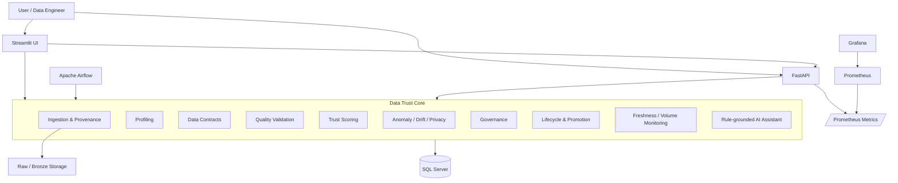
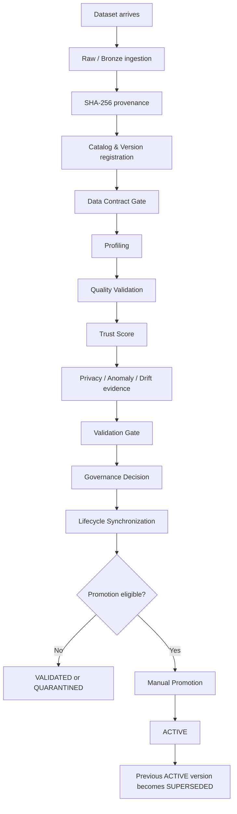
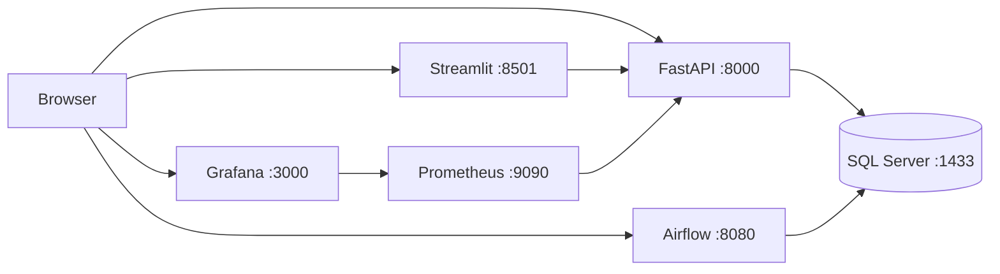

# AI Data Trust Platform — Architecture

## 1. Architecture Goals

AI Data Trust Platform is designed as a portfolio-grade prototype of a governed, observable data platform.

The architecture separates responsibilities between ingestion and provenance, data quality and trust evaluation, governance and lifecycle management, persistence, APIs, orchestration, observability, and presentation.

A central design principle is:

> Data arriving in the platform does not mean that the data is trusted or approved for use.

A dataset must move through validation and governance before it can become ACTIVE.

---

## 2. High-Level Architecture



The Streamlit application is currently in a transitional architecture.

Newer operational pages communicate through FastAPI service clients, while some older analytical pages still call core modules and repositories directly.

This is intentional technical debt that can be migrated incrementally.

---

## 3. Main Runtime Components

### FastAPI

FastAPI provides the backend API boundary for platform operations.

Main API areas include:

- governed dataset workflows,
- dataset lineage,
- dataset promotion,
- persisted scan history,
- Data Contract management,
- pipeline run history,
- operational events,
- Freshness monitoring,
- Volume monitoring,
- observability overview,
- Trust Score calculation,
- and the rule-grounded Assistant.

FastAPI should remain primarily a transport layer.

Business rules should live in core services and repositories rather than being duplicated inside route handlers.

### Streamlit

Streamlit provides the interactive user interface.

The application contains pages for dataset upload, profiling, quality issues, Trust Score, anomaly detection, drift detection, privacy scanning, dataset governance, Data Contracts, pipeline operations, operational alerts, Freshness monitoring, Volume monitoring, and the observability overview.

Operational monitoring pages use dedicated API client modules under:

```text
app/services/
```

This reduces direct coupling between UI code and backend implementation details.

### SQL Server

SQL Server is the persistent metadata and operational state store.

It stores information such as dataset catalog records, dataset versions, ingestion events, validation history, governance decisions, lifecycle transitions, scan history, quality issues, Trust Scores, Data Contracts, Data Contract validation history, pipeline runs, operational events, Freshness policies and checks, and Volume policies and checks.

The database acts as an operational system of record for platform metadata.

### Apache Airflow

Airflow orchestrates background and scheduled platform workflows.

Current orchestration responsibilities include:

```text
ai_data_trust_pipeline
data_freshness_monitor
data_volume_monitor
```

The main dataset pipeline executes the governed workflow.

Freshness and Volume monitoring DAGs execute scheduled observability checks over enabled monitoring policies.

Monitoring jobs are designed to be idempotent so repeated scheduling does not produce duplicate checks or duplicate operational alerts for the same event.

### Prometheus and Grafana

FastAPI exposes application metrics through:

```text
/metrics
```

Prometheus scrapes these metrics, while Grafana visualizes operational signals from Prometheus.

HTTP metrics use route templates instead of raw dynamic paths to reduce high-cardinality metric labels. Health and readiness probes are excluded from business traffic metrics.

---

## 4. Governed Dataset Workflow

The main governed workflow is:



Promotion is deliberately separated from ingestion.

The platform therefore distinguishes:

```text
data arrived
```

from:

```text
data is trusted and approved for downstream use
```

---

## 5. Dataset Versioning and Provenance

Each ingestion generates provenance information including:

- normalized file name,
- content SHA-256,
- source type,
- byte size,
- ingestion identifier,
- raw artifact location.

Dataset versions are content-aware.

Conceptually:

```text
same logical dataset
+ different SHA-256
= new dataset version
```

If the content hash already exists, the platform can reuse the known version and record a new ingestion event rather than blindly creating duplicate versions.

---

## 6. Data Contract Architecture

Data Contracts provide schema expectations before the rest of the governed workflow continues.

A contract can define expected columns, expected semantic data types, required columns, nullability, and enforcement mode.

Supported enforcement modes are:

```text
BLOCK
WARN
```

`BLOCK` can stop incompatible datasets.

`WARN` records the breaking contract result but allows processing to continue.

Contracts are versioned and only one contract is active for a catalog at a time.

---

## 7. Validation, Governance and Lifecycle

Validation and governance are separate concepts.

### Validation

Validation answers:

> Does the dataset satisfy technical data-quality requirements?

Current lifecycle outcomes include:

```text
NEW
VALIDATED
QUARANTINED
ACTIVE
SUPERSEDED
```

### Governance

Governance answers:

> Based on the collected evidence, should this dataset be allowed to progress?

A dataset that has technically passed validation is not automatically promoted.

Promotion requires the expected governance evidence.

This keeps the lifecycle state backed by persisted decisions rather than UI-only state.

---

## 8. Observability Architecture

The platform currently monitors three main operational areas:

```text
Pipeline execution
Dataset Freshness
Dataset Volume
```

### Pipeline Runs

Airflow executions are persisted to SQL Server with metadata such as DAG ID, Airflow run ID, status, dataset identifiers, validation result, governance decision, lifecycle state, duration, and error information.

### Freshness Monitoring

Freshness monitoring compares the latest ingestion time with a configured maximum allowed age.

Typical states are:

```text
FRESH
STALE
NO_DATA
```

A stale incident can emit a persisted operational event.

### Volume Monitoring

Volume monitoring compares the latest row count with the previous ingestion.

Typical states are:

```text
NORMAL
DROP
SPIKE
NO_BASELINE
```

Threshold breaches can emit operational events.

Repeated checks for the same ingestion are idempotent.

---

## 9. Operational Events

Operational Events provide a common incident model.

Events can carry event type, severity, source, stage, catalog ID, version ID, pipeline run ID, reference ID, message, and structured detail.

Freshness and Volume monitoring use this layer instead of implementing separate alert stores.

This gives the platform one persisted operational-event history for future alerting and AI-assisted incident analysis.

---

## 10. Observability Overview

The Observability Overview API aggregates platform health across enabled Freshness policies, latest Freshness status, enabled Volume policies, latest Volume status, latest Pipeline status, recent Pipeline failures, and recent Operational Events.

The Streamlit observability dashboard consumes this aggregate API instead of querying SQL Server directly.

This forms the current control-center view of the platform.

---

## 11. AI Assistant

The current Assistant is intentionally rule-grounded.

Its responsibility is to explain supplied platform evidence rather than invent facts outside that evidence.

Conceptually:

```text
Platform evidence
      |
      v
Context builder
      |
      v
Rule-grounded Assistant
      |
      v
Explanation / recommendation
```

The current Assistant should therefore be treated as the foundation for a later AI Observability Assistant.

A future version can combine persisted incidents, lineage, contract violations, quality findings and pipeline history into richer grounded explanations.

---

## 12. Streamlit API Client Layer

Operational Streamlit pages now use dedicated client modules:

```text
app/services/freshness_api.py
app/services/volume_api.py
app/services/observability_api.py
```

This creates the separation:

```text
Streamlit Page
     |
     v
API Client
     |
     v
FastAPI
     |
     v
Core / Repository
     |
     v
SQL Server
```

The long-term direction is to migrate more UI pages toward this architecture.

---

## 13. Deployment Topology

Local development uses Docker Compose.

Conceptually:



Bootstrap containers prepare database state before dependent services start.

Health and readiness checks help Docker Compose coordinate service startup.

---

## 14. CI Architecture

GitHub Actions runs automated validation for pushes to `main`, feature branches, and pull requests targeting `main`.

The CI pipeline performs:

```text
dependency installation
        |
        v
pip check
        |
        v
Ruff
        |
        v
pytest
        |
        v
compileall
```

This ensures the repository remains lintable, testable and importable before changes are merged.

---

## 15. Current Architectural Strengths

The project currently demonstrates:

- separation between core logic and transport layers,
- SQL-backed operational state,
- dataset versioning and lineage,
- governed promotion,
- versioned Data Contracts,
- orchestration with Airflow,
- persisted observability history,
- idempotent scheduled monitoring,
- API-backed operational dashboards,
- metric monitoring with Prometheus and Grafana,
- automated tests and CI,
- and a grounded Assistant foundation.

---

## 16. Known Technical Debt

The project intentionally still has areas for improvement.

The main examples are:

- some older Streamlit pages access repositories or core modules directly,
- the current Raw/Bronze layer uses local filesystem storage,
- batch processing still primarily uses pandas,
- there is no event-streaming layer yet,
- the AI Assistant is still rule-grounded rather than a richer retrieval/tool-based assistant,
- the Streamlit design system is not yet fully standardized,
- production authentication and authorization are outside the current portfolio scope.

These are future evolution points rather than hidden limitations.

---

## 17. Planned Evolution

The next development waves can evolve the architecture in this order:

```text
Current governed and observable batch platform
        |
        v
AI Observability Assistant
        |
        v
Object-storage abstraction
        |
        v
Event-driven / Kafka ingestion use case
        |
        v
Distributed Spark processing use case
        |
        v
Technical scope freeze
        |
        v
Final UI polish and portfolio release
```

New technologies should be introduced only when they solve a concrete platform problem rather than only increasing the technology list.

---

## 18. Architecture Principle

The project follows one recurring principle:

> Keep business truth in the core and persistence layers; let APIs, orchestration and UI act as adapters around that truth.

This helps the same dataset produce consistent results whether it is processed from Streamlit, FastAPI, Airflow, tests or future integrations.
